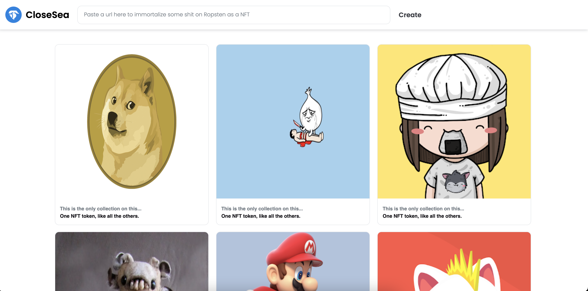

### Ropsten has been deprecated, so it won't work! 😱
### I have to update it but right now I'm feeling lazy. The code is still valid though.

# NFT Marketplace Portfolio Project

## A NFT marketplace made in Solidity, NextJs, Typescript, Truffle, and ethersjs
  ---
### You can find the deploy here: https://portfolio-ethereum-nft-marketplace.vercel.app/
  ---
<h3>Technologies used on the front-end</h3>
<ul>
  <li>NextJs</li>
  <li>Typescript</li>
  <li>Styled-Components</li>
  <li>Ethersjs</li>
</ul>

<h3>Technologies used on the back-end (Ethereum blockchain)</h3>
<ul>
  <li>Solidity</li>
  <li>Truffle</li>
  <li>OpenZeppelin (NFT protocols)</li>
  <li>Chai (testing)</li>
</ul>

 

  ---

  <h3>Instructions</h3>

  

    To run the project, just install de dependencies and type 'yarn dev', just like any project in NextJs.
  

  

    To play with the project, you gonna need to have <a href='https://metamask.io/'>MetaMask</a> installed.
  

  

    Once installed, just set it to the Ropsten network. Make sure you have some Ropsten ether on it. 
  

  

    Please don't upload anything besides image urls. I haven't added validation yet, so it gonna break the website layout. 
  

  

    Please don't upload anything shameful. Once uploaded a picture to the blockchain it can't be removed, so I'm going to have to redeploy the contract.
  

 

Please feel free to take a look at the code, fork it, steal it, whatever. 

